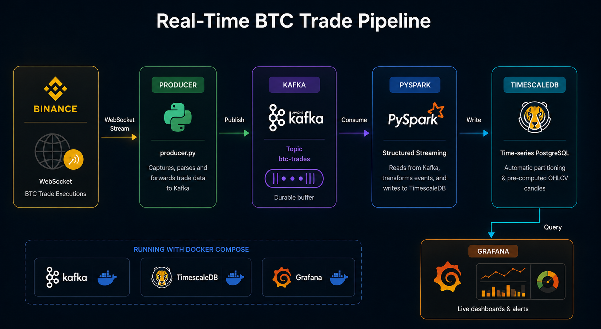
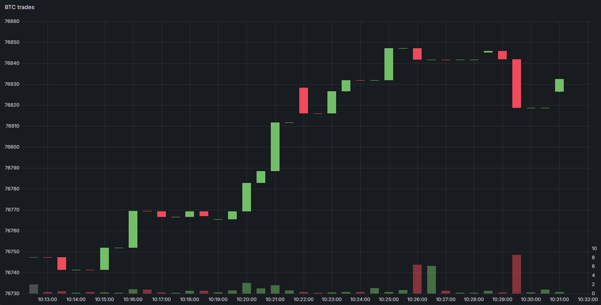

# BTC Trades Pipeline

Real-time BTC trade data pipeline using Binance websocket, that aggregates and displays ohlcv information

## Architecture

- The Binance websocket is free to use and is a great source of real-time data. It also has multiple libraries available to make the connection easier, such as the python-binance
- Kafka, TimescaleDB and Grafana all run in docker and generally integrate well with each other with PySpark as an intermediate step
- TimescaleDB is already optimized for time series data, making it optimal for this use case
- Grafana can display the data real time, with intuitive GUI and candlestick visualization preset

## Setup
1. Copy `.env.example` to `.env` and fill in your Binance API keys (you will need to create an account)
2. `docker compose up -d`
3. `pip install -r requirements.txt`
4. `python producer.py` (Terminal 1)
5. `python consumer.py` (Terminal 2)

## Results with Grafana

